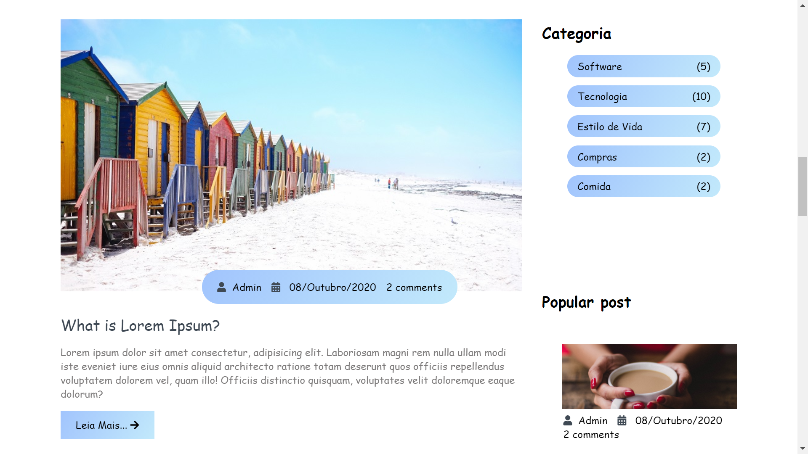
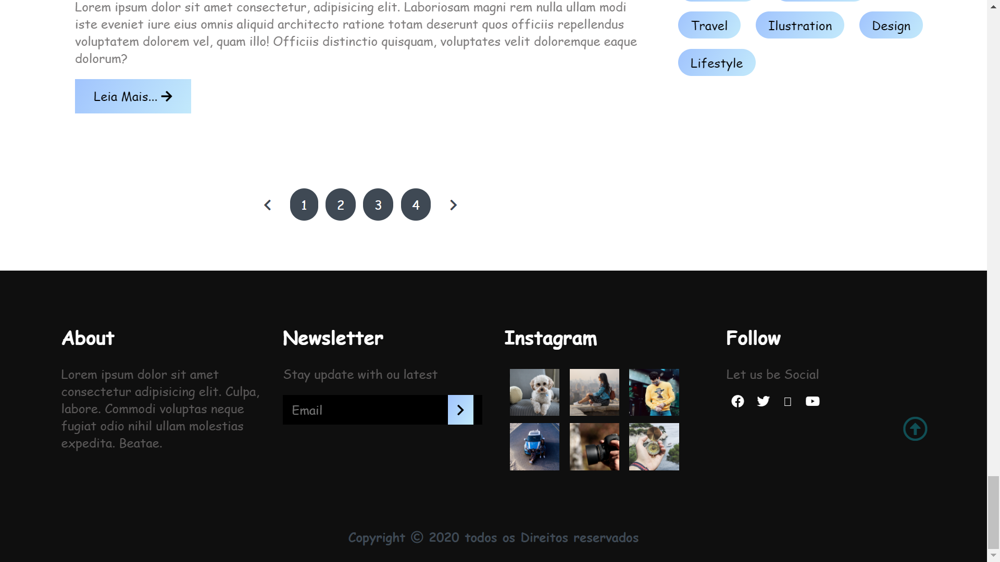

# Blogger

 
 <h1 align="center">Layout de um Blogger completo utilizando HTML/CSS/JavaScript</h1>
  <h1 align="center">
  
</h1>
 <h1 align="center">
    HTML/CSS/JavaScript
</h1>

🚀 Desenvolvi um Layout de Blogger 

 
 <h4 align="center"> 
	Projeto Finalizado.
</h4>

 <h1 align="center">
  
  
 parte do corpo do Blogger

</h1
	

	<h1 align="center">
  
  
 parte do corpo do Blogger

</h1>
	
